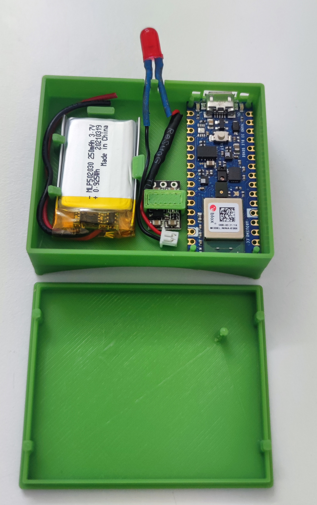

# Gait Event Detection Device -> Validated

## Background
The gait events detection algorithm is based on angular velocity data from a single gyroscope mounted on the shank. The code was written for ***Arduino Nano 33 BLE Sense***. The developed device is part of a research study on the effect of haptic feedback on walking biomechanics parameters. With the algorithm, we can detect ***heel-strike*** and ***mid-swing events*** with ***high accuracy*** and provide gait event-dependent ***biofeedback***. 

The device was designed to be versatile and can be ***easily modified for other applications*** that could benefit from ***real-time gait event detection***, ***gait event-dependent feedback***, and ***gait data collection***. Angular velocity data can be collected with a nearby phone via BLE. The device is not confined to the lab setting. It can be modulated for other applications by adding sensors and functions, such as surface electromyography for muscle function monitoring, auditory and visual for biofeedback, and exoskeleton control for assistive walking.

We have validated the gait event detection algorithm's accuracy at detecting heel-strike. We have evaluated healthy participants' changes in ankle flexion moment and flexion angle when intermittent vibration is applied to the lower leg.

The accuracy of the gait event detection algorithm was validated against gold standard floor-embedded force plates (model BMS400600, AMTI, MA, USA). We compared the time difference between detecting a heel-strike event by the force plates and the device. The detection of heel-strike events in real-time by the device showed excellent agreement with the force plates at all three speeds (ICC = 1). Our device's mean difference and standard deviation in heel-strike detection are 19 ± 22 ms, and the sampling rate was 100 Hz. 

## Table of Contents
- [Background](#background)
- [Using the code for event-dependent processes and gait analysis](#using-the-code-for-event-dependent-processes-and-gait-analysis)
  * [Controlling the device via the nRF Connect app](#controlling-the-device-via-the-nrf-connect-app) 
  * [Algorithm workflow](#algorithm-workflow)
  * [Modifying the biofeedback](#modifying-the-biofeedback)
- [Device design and electrical diagram](#device-design-and-electrical-diagram)
  * [Electrical diagram](#electrical-diagram)
  * [Gait event detection validation](#gait-event-detection-validation)
  * [Gait dependent biofeedback](#gait-dependent-biofeedback)
- [License](#license)
- [Citation](#citation)
- [Contact](#contact)

## Using the code for event-dependent processes and gait analysis

The algorithm detects two gait events (heel-strike and mid-swing); however, accuracy measurements were done for heel-strike events. Our application was to use heel-strike events detection to activate intermittent vibration during specific parts of the stance phase. The code can be modified to provide any event-based processes that are in the scope of Arduino's abilities. 

We have uploaded three examples to this repository of using the algorithm. You can also find two ways to convert the recorded data from nRF Connect to meaningful angular velocity values. The first option is MATLAB code that does that automatically, and the second option is with Excel. All examples record the gyroscope's data to a buffer that can be sent to the phone at the end of each run. Only the `GaitDetectionOnlyRecordingGyro.ino` example is sending the data in real time.

Here are the examples:
- [GaitDetectionOnlyRecordingGyro.ino](GaitDetectionOnlyRecordingGyro/GaitDetectionOnlyRecordingGyro.ino) – sending gyroscope data to nRF Connect in real-time.
- [GaitDetectionLightOnly.ino](GaitDetectionLightOnly/GaitDetectionLightOnly.ino) – turning on LED on heel-strike events and turning it off on calculated toe-off events.
- [GaitDetectionWithVibration.ino](GaitDetectionWithVibration/GaitDetectionWithVibration.ino) – turning on the first vibration motor at heel-strike and turning on the second motor at about 30% of the gait cycle. Both motors are turned off at toe-off events (about 60% of the gait cycle).
- [DataConversionXMLtoMatlab.m](DataConversionXMLtoMatlab.m) – import recorded XML files and converts the data to angular velocity meaningful values using MATLAB.
- [GyroDataExcelTutorial.pdf](GyroDataExcelTutorial.pdf) – you can also use Excel to convert angular velocity to meaningful values. Explanation on how to convert gyro data from XML file to Excel by Omri Yosfan (omri.yy@gmail.com).

### Controlling the device via the nRF Connect app
After uploading the code to the Arduino Nano 33 BLE Sense, the device will be in standby mode, waiting for Bluetooth connection and commands. There are three commands:

`01` – "Reset", reset buffer

`02` – "Record", run the gait detection algorithm, send real-time gyroscope data, and/or provide event-dependent processes (when applicable).

`03` – "Replay", resend gyroscope data.

When sending the command "02", the code will run for the amount of time set by ` #define RECORDING_LENGTH_SECONDS `.

####  Working with the nRF Connect app 

**Step 1:** Download and install the app from your phone app store and give the required permissions. [https://www.nordicsemi.com/Products/Development-tools/nrf-connect-for-mobile](https://www.nordicsemi.com/Products/Development-tools/nrf-connect-for-mobile )

**Step 2:** Open the app and turn on Bluetooth and location access. Click on the scan button and connect to your device (the default is "Nitzan Arduino").

**Step 3:** Press on the three dots next to "SERVER", click on "Request connection priority" and choose "HIGH".

        

**Step 4:** Press on "Unknown Service" and then press on the three arrows pointing down next to "Unknown Characteristic", this will let you receive the data from the Arduino.

**Step 5:** SENDING COMMANDS. As mentioned above, there are three commands, each with a corresponding number. Press on the middle arrow pointing UP to open the command dialog. Press "SEND" to commit the command.

        

**Step 6:** RECORDING THE DATA and saving it. The nRF Connect app receives the angular velocity data in real-time. To record the data, press on the red button and then on the red recording button. To stop the recording, press on the red button with a square inside and give the recording a name. 

*Important*: the three arrows pointing down must be pressed for real-time data streaming.

        

        

**Step 7:** Export the recording to an XML file and save it on your phone for post-processing gait analysis. Post-analysis can be done using the raw data with the MATLAB code or the excel tutorial. You can find a discussion about the raw data import and conversion on the [looking-for-ble-logger-app](https://forum.arduino.cc/t/looking-for-ble-logger-app/870554) Arduino forum.

### Algorithm workflow
The algorithm detects two distinct gait events in real-time: mid-swing and heel-strike. These gait events are calculated by unique features of the angular velocity signal, such as the global maxima, zero-crossing, and local negative minima, as described by Fu-Cheng Wang et al (2020)., (Figure 1). We incorporated a patient-specific gait pattern self-correcting adjustment of the mid-swing threshold to prevent false detection of mid-swing events. In every gait cycle, we calculated the user's mid-swing average value using a moving-average function with a window size of three data points of the earlier mid-swing events value. We set the mid-swing threshold value to half the mid-swing average. Gait cycle duration was calculated as the time between the current mid-swing event and the previous one. The toe-off event was calculated as 60% of the gait cycle duration. 

 
<b>Figure 1. An angular velocity graph is taken from a gyroscope sensor on the shank of a healthy participant. (+): a distinct gait event. From left to right: mid-swing, heel-strike, and toe-off.</b>

Upon algorithm startup, it establishes the initial gait cycle duration and updates the user-specific mid-swing threshold from the first two steps (three global maximum). Next, the algorithm searches for the first negative minimum after mid-swing, which would be a heel-strike event. In some individuals, there is a positive local maximum after the heel-strike caused by the impact of the heel-strike and shank moment-of-inertia. Therefore, five sample points after a heel-strike event was detected are being ignored to avoid false-positive mid-swing detection. Gait cycle duration and mid-swing values are constantly updated. Suppose the interval between two successive mid-swing events is higher than 1.5 times the average gait cycle duration; then, the algorithm treats it as if the person turned around or stopped and waits for the subsequent step initiation. An algorithm workflow diagram is depicted in Figure 2.

 
<b>Figure 2. Workflow chart of the algorithm logic of the gait events detection. g(t) is the current gyroscope value, MS_th is the threshold value for searching for mid-swing, SL_t(t) is the current step length time, and SL_avg is the step length average time. A green box represents an input signal, and a trapezoid represents condition statements.</b>

### Modifying the biofeedback
In examples "GaitDetectionLightOnly.ino" and "GaitDetectionWithVibration.ino", you can find the function `void vibrationTask()`
. To start ***your*** biofeedback, insert the part of your code after `if (readyToVibrate) { `. To stop ***your*** biofeedback, insert your end condition after     
` if (vibrationPhase) { ` .

## Device design and electrical diagram
The enclosures were printed in a 3D printer and STL files are available in the "Enclosures" folder.

### Electrical diagram
Below is an electrical diagram of the device.

 
<b>Figure 3. Circuit diagram of phase 2, units, and components list.</b>

### Gait event detection validation
Below are pictures of the gait event detection device, operating a red LED indicator. Example: `GaitDetectionLightOnly.ino`

        

### Gait dependent biofeedback
Below is the complete device with two vibration motors that provide haptic feedback. Example: `GaitDetectionWithVibration.ino` 

                

        

        

## License 
Copyright 2022 Nitzan Breitman 

Licensed under the Educational Community License, Version 2.0 (the "License"); you may not use this file except in compliance with the License. 

You may obtain a copy of the License at [https://opensource.org/licenses/ECL-2.0](https://opensource.org/licenses/ECL-2.0)

Unless required by applicable law or agreed to in writing, software distributed under the License is distributed on an "AS IS" BASIS, WITHOUT WARRANTIES OR CONDITIONS OF ANY KIND, either express or implied.

See the License for the specific language governing permissions and limitations under the License.

The Educational Community License version 2.0 ("ECL") consists of the Apache 2.0 license, modified to change the scope of the patent grant in section 3 to be specific to the needs of the education communities using this license. The original Apache 2.0 license can be found at: http://www.apache.org/licenses/LICENSE-2.0

## Citation
Remember to give the appropriate credit to the creators of the work. 

## Contact
Nitzan Breitman: :email: [nitzan.breitman@gmail.com](mailto:nitzan.breitman@gmail.com)

LinkedIn: [https://www.linkedin.com/in/nitzan-breitman/](https://www.linkedin.com/in/nitzan-breitman/)
 
